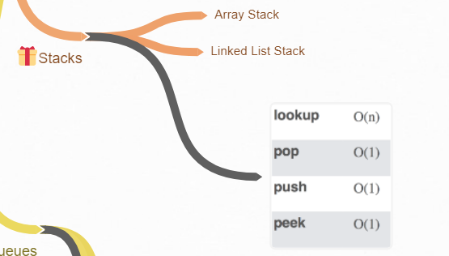

# Stacks

This section covers essential concepts, operations, and complexities related to stacks in Python.

---

## **Table of Contents**
1. [Introduction to Stacks](#introduction-to-stacks)
2. [Common Operations and Their Complexities](#common-operations-and-their-complexities)
3. [Stack Implementations in Python](#stack-implementations-in-python)
4. [Key Points](#key-points)
5. [Example Code Snippets](#example-code-snippets)
6. [Solved Problems](#solved-problems)

---

## **Introduction to Stacks**
- A **stack** is a linear data structure that follows the **Last In, First Out (LIFO)** principle, meaning the last item added is the first to be removed.
- It is commonly used in function call management, expression parsing, backtracking algorithms, and undo operations.

---

## Stacks Operations Visualization

Below is a helpful visualization of common Stacks operations, complexities, and sorting algorithms, the entire diagram is at [Technical Interview Mindmap](https://coggle.it/diagram/W5E5tqYlrXvFJPsq/t/master-the-interview-click-here-for-course-link):



## **Common Operations and Their Complexities**

| Operation         | Time Complexity | Description                                                                 |
|-------------------|-----------------|-----------------------------------------------------------------------------|
| Push (append)     | **O(1)**        | Add an element to the top of the stack.                                     |
| Pop               | **O(1)**        | Remove the top element from the stack.                                      |
| Peek (top)        | **O(1)**        | View the top element without removing it.                                   |
| Check Empty       | **O(1)**        | Verify if the stack contains no elements.                                   |
| Iteration         | **O(n)**        | Traverse through all elements in the stack.                                 |
| Search            | **O(n)**        | Linear search to find an element (stacks do not allow random access).       |

---

## **Stack Implementations in Python**
Python does not have a built-in `Stack` class, but you can implement stacks using:
1. **Lists**:
   - Use `list.append()` for push and `list.pop()` for pop operations.
   - Efficient for stack operations at the end of the list.
2. **`collections.deque`**:
   - Use `deque.append()` for push and `deque.pop()` for pop operations.
   - Preferred for better performance with stack-like operations.
3. **Custom Classes**:
   - Create a custom `Stack` class to encapsulate the behavior.

---

## **Key Points**
- **LIFO Principle**: The last element added is the first to be removed.
- **Restricted Access**: Unlike lists, stacks allow operations only at the top (end).
- **Efficient Operations**: Push, pop, and peek are O(1) operations.

---

## **Example Code Snippets**

### Stack Implementation Using a List:
```python
stack = []

# Push elements onto the stack
stack.append(10)
stack.append(20)
stack.append(30)

# Peek at the top element
print(stack[-1])  # Output: 30

# Pop an element from the stack
print(stack.pop())  # Output: 30

# Check if the stack is empty
print(len(stack) == 0)  # Output: False
```

### Stack Implementation Using `deque`:
```python
from collections import deque

stack = deque()

# Push elements onto the stack
stack.append(10)
stack.append(20)
stack.append(30)

# Peek at the top element
print(stack[-1])  # Output: 30

# Pop an element from the stack
print(stack.pop())  # Output: 30

# Check if the stack is empty
print(len(stack) == 0)  # Output: False
```

### Custom Stack Class:
```python
class Stack:
    def __init__(self):
        self.stack = []

    def push(self, item):
        self.stack.append(item)

    def pop(self):
        if not self.is_empty():
            return self.stack.pop()
        raise IndexError("pop from empty stack")

    def peek(self):
        if not self.is_empty():
            return self.stack[-1]
        raise IndexError("peek from empty stack")

    def is_empty(self):
        return len(self.stack) == 0

# Usage
my_stack = Stack()
my_stack.push(10)
my_stack.push(20)
print(my_stack.peek())  # Output: 20
print(my_stack.pop())   # Output: 20
```

---

## **Solved Problems**

Below are links to solved stack-related problems with explanations:

| Problem Name              | Difficulty | Solution Link                                   |
|---------------------------|------------|-----------------------------------------------|
| Valid Parentheses         | Easy       | [Valid Parentheses Solution](problems/valid_parentheses.py) |
| Min Stack                 | Medium     | [Min Stack Solution](problems/min_stack.py)   |
| Daily Temperatures        | Medium     | [Daily Temperatures Solution](problems/daily_temperatures.py) |
| Evaluate Reverse Polish   | Medium     | [Evaluate Reverse Polish Notation](problems/reverse_polish.py) |

---