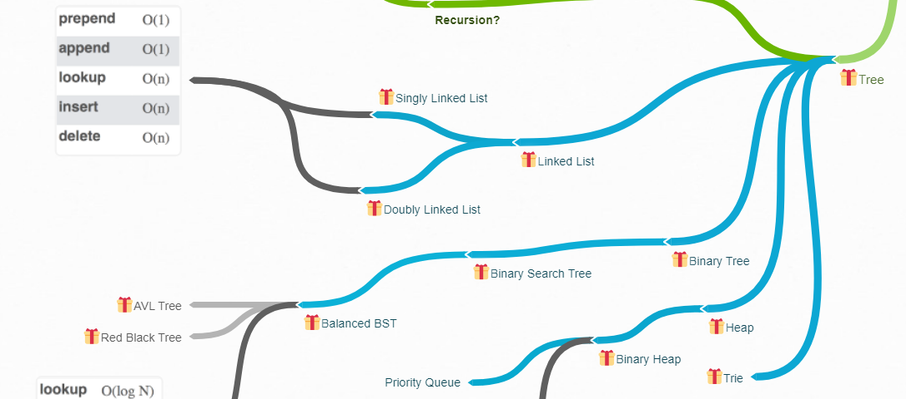

## **Introduction to Linked Lists**

Imagine a chain where each link holds a value and points to the next link. That’s what a **linked list** is—a series of connected nodes. Unlike arrays, linked lists don’t need to store data in one continuous block of memory. This makes them flexible and efficient for certain operations.

## Linked Lists Operations Visualization

Below is a helpful visualization of common Linked Lists operations, complexities, and sorting algorithms, the entire diagram is at [Technical Interview Mindmap](https://coggle.it/diagram/W5E5tqYlrXvFJPsq/t/master-the-interview-click-here-for-course-link):



### Why Use Linked Lists?  
Arrays are great but:
- They need extra time (O(n)) to insert or delete in the middle because everything has to shift.
- Resizing arrays can be slow and costly.

Hash tables are fast for lookups, but they don’t maintain any order.

**Linked lists** step in to balance these trade-offs. They make it easier to insert and delete elements without worrying about shifting data or resizing, and they can maintain an order!

---

## **How Linked Lists Work**

A linked list is made up of **nodes**.  
Each node has:
1. **Data**: The actual value you want to store.
2. **Pointer**: A link to the next node in the chain.

- The first node is called the **head**.
- The last node is the **tail**, and it points to `null` (signifying the end of the list).  

Here’s a simple diagram:  
```
Head -> [5 | *] -> [10 | *] -> [15 | null]
```
- `[5 | *]` means the node holds the value `5` and points to the next node.

---

## **Types of Linked Lists**

1. **Singly Linked List**:  
   Each node points to the next one.  
   Think of it as a one-way street.

2. **Doubly Linked List**:  
   Nodes point to both the next and the previous ones.  
   This allows you to move in both directions.

3. **Circular Linked List**:  
   The tail connects back to the head, forming a loop.

---

## **Advantages of Linked Lists**

- **Insertions and Deletions**:  
  Adding or removing a node is easy. You just update the pointers. No need to shift elements around like in an array.
  
- **Dynamic Size**:  
  Linked lists don’t need a fixed size upfront. You can keep adding nodes as long as there’s memory.

- **Order**:  
  Unlike hash tables, nodes maintain an order.

---

## **Disadvantages of Linked Lists**

- **Slow Lookup**:  
  To find a specific node, you have to start at the head and go through the list (O(n)). There’s no direct access like arrays.

- **Memory Usage**:  
  Each node uses extra memory for the pointer.

- **Slower Traversal**:  
  Linked list nodes are scattered in memory, so accessing them isn’t as fast as accessing array elements, which are stored together.

---

## **Big-O Complexity**

| Operation       | Time Complexity |
|------------------|-----------------|
| Prepend (Add to head) | O(1)       |
| Append (Add to tail)  | O(1)       |
| Lookup                | O(n)       |
| Insert/Delete (Middle)| O(n)       |

---

## **Comparison: Linked Lists vs Arrays**

| Feature              | Arrays            | Linked Lists         |
|-----------------------|-------------------|----------------------|
| Memory Allocation    | Continuous        | Scattered            |
| Access (Index)       | O(1)              | O(n)                 |
| Insert/Delete (Middle)| O(n)              | O(1) (after traversal) |
| Resizing Overhead    | Yes (dynamic)     | No                   |

---

## **When Should You Use Linked Lists?**

- When you need to insert or delete elements frequently, especially in the middle of the list.
- When memory isn’t guaranteed to be continuous.
- When maintaining an order is important.

