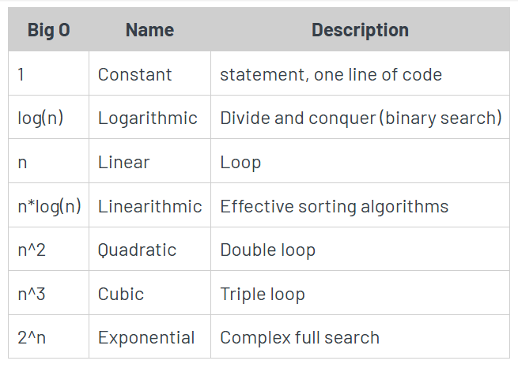
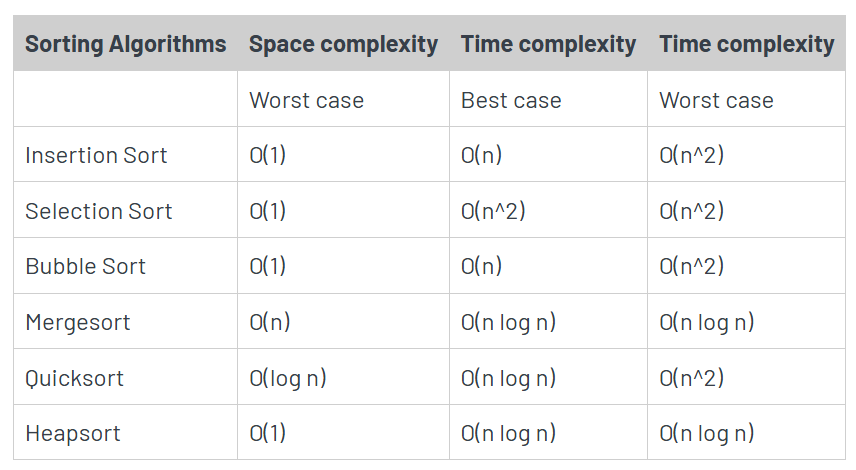
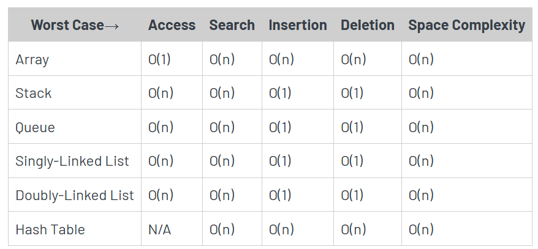

# Data Structures

This section covers fundamental concepts related to data structures, algorithms, and their complexities.

I have taken the info below from, [Zerotomastery](https://zerotomastery.io/cheatsheets/big-o-cheat-sheet/?utm_source=udemy&utm_medium=coursecontent)

---

## Big O's

A summary of common Big O complexities:

- **O(1) Constant**: No loops.
- **O(log N) Logarithmic**: Typically searching algorithms like Binary Search when data is sorted.
- **O(n) Linear**: Single loops, iterating through `n` items.
- **O(n log(n)) Log Linear**: Usually sorting operations.
- **O(n^2) Quadratic**: Comparing every element with every other element (e.g., two nested loops).
- **O(2^n) Exponential**: Recursive algorithms solving a problem of size `N`.
- **O(n!) Factorial**: Adding a loop for every element.

### Notes:
- Iterating through half a collection is still **O(n)**.
- Two separate collections result in **O(a * b)**.

---

## What Can Cause Time in a Function?

- Operations (`+`, `-`, `*`, `/`)
- Comparisons (`<`, `>`, `===`)
- Looping (`for`, `while`)
- Outside function calls (`function()`)

---

## Sorting Algorithms

---

## Common Data Structure Operations

---

## Rule Book

1. **Always Worst Case**: Analyze based on the worst-case scenario.
2. **Remove Constants**: Ignore constant factors in complexity.
3. **Different Inputs → Different Variables**:
   - Example: O(a + b) for two separate inputs.
   - Nested loops across different inputs: O(a * b).
4. **Drop Non-Dominant Terms**: Keep the most significant term.

---

## What Causes Space Complexity?

Factors affecting space complexity:
- Variables
- Data Structures
- Function Calls
- Allocations

---

## Are Stack and Queue types of Linked Lists in Python? If so, why not cover them together?

In Python, **stacks**, **queues**, and **linked lists** are not directly types of one another but are closely related data structures. Here’s how they interrelate:

1. **Linked List**:
   - A **linked list** is a foundational data structure where elements (nodes) are connected via pointers (next/previous references).
   - It provides dynamic memory allocation and is often used to build other data structures like **stacks** and **queues**.

2. **Stack**:
   - A **stack** follows the **Last In, First Out (LIFO)** principle:
     - Push (add) elements to the "top."
     - Pop (remove) elements from the "top."
   - While stacks can be implemented using linked lists (to leverage dynamic memory), Python commonly uses a **list** or **deque** (`collections.deque`) for stacks because of its built-in efficiency for append and pop operations.

3. **Queue**:
   - A **queue** follows the **First In, First Out (FIFO)** principle:
     - Enqueue (add) elements to the "rear."
     - Dequeue (remove) elements from the "front."
   - Similarly, queues can be implemented using linked lists, but in Python, the preferred approach is **deque** for efficiency.

### **Why Not Cover Them Together?**

While they can be implemented using linked lists, **stacks** and **queues** serve distinct purposes:
1. **Different Use Cases**:
   - **Linked List**: Used for dynamic data structures like memory management, adjacency lists in graphs, and more.
   - **Stack**: Useful for undo operations, expression evaluation, and recursion handling.
   - **Queue**: Important for scheduling tasks, breadth-first search (BFS), and buffering.

2. **Built-In Alternatives in Python**:
   - Python provides optimized implementations for stacks and queues:
     - **Stack**: Use a Python `list` or `collections.deque`.
     - **Queue**: Use `collections.deque` or `queue.Queue`.
     - **Linked List**: Typically implemented manually for learning purposes since Python lacks a built-in `linked list` structure.

3. **Conceptual Independence**:
   - Grouping these structures together may confuse learners about their specific use cases. Covering them separately clarifies their individual functionalities and Python’s efficient alternatives.

### **Conclusion**:
- Conceptually, stacks and queues can be considered "special cases" of linked lists.
- However, Python's built-in structures like `deque` make separate implementations more practical and efficient.

---

